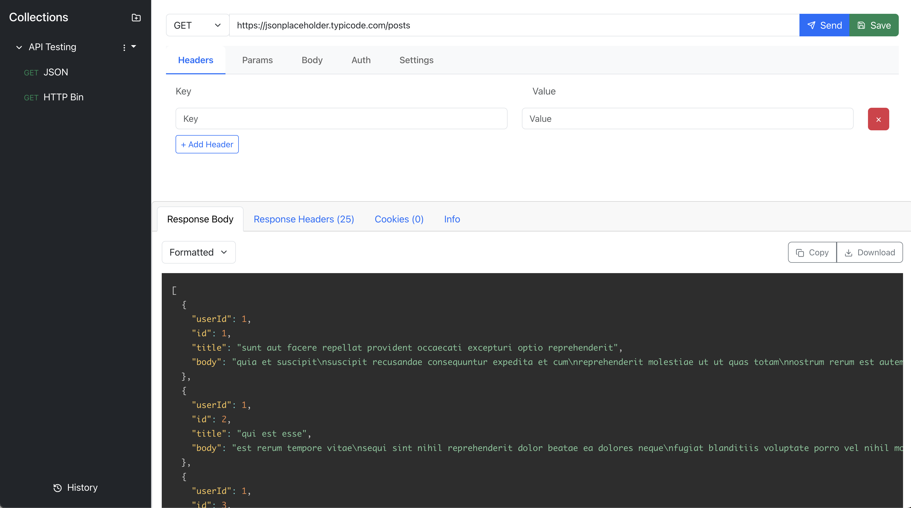

# Transmit - Open Source API Testing Platform

Transmit is a modern, feature-rich API testing platform built with React. It provides an intuitive interface for testing HTTP APIs, managing collections of requests, and analyzing responses.




## Features

### Request Management
- Support for all standard HTTP methods (GET, POST, PUT, DELETE, PATCH, OPTIONS, HEAD)
- Organized request configuration tabs:
    - Headers
    - Parameters
    - Body (JSON, form-data, x-www-form-urlencoded)
    - Authentication
    - Settings

### Authentication Support
- No Auth
- Basic Auth
- Bearer Token
- API Key (Header or Query Parameter)

### Request Collections
- Create and manage collections of API requests
- Organize requests within collections
- Rename or delete collections
- Import and export collections
- Save frequently used requests

### Response Analysis
- Formatted response viewing with syntax highlighting
- Multiple response view modes:
    - Pretty (formatted)
    - Raw
    - Table view for array responses
- Response information tabs:
    - Body
    - Headers
    - Cookies
    - Info (status, time, size)
- Copy response data to clipboard
- Download response data

### History
- Automatic request history tracking
- View and reuse previous requests
- Clear history option

### Advanced Features
- Environment variable support with {{variable}} syntax
- Configurable request timeouts
- SSL verification settings
- HTTP version selection
- Redirect handling
- Cookie management

## Installation

1. Clone the repository:
```bash
git clone https://github.com/yourusername/transmit.git
cd transmit
```

2. Install dependencies:
```bash
npm install
```

3. PHP Proxy Setup:
   The project includes a `proxy.php` file in the root directory that handles API requests. This proxy is necessary to avoid CORS issues and provide additional functionality.

    - Configuration Requirements:
        - PHP 7.4 or higher
        - cURL extension enabled
        - JSON extension enabled

    - Setup Steps:
      ```bash
      # If using PHP's built-in server for development
      php -S localhost:8000
      ```

      Or configure in Apache/Nginx:
      ```apache
      # Apache (.htaccess)
      <FilesMatch "\.php$">
          SetHandler application/x-httpd-php
      </FilesMatch>
      ```

      ```nginx
      # Nginx
      location ~ \.php$ {
          include fastcgi_params;
          fastcgi_pass unix:/var/run/php/php7.4-fpm.sock;
          fastcgi_param SCRIPT_FILENAME $document_root$fastcgi_script_name;
      }
      ```

    - Default Configuration:
      The proxy automatically:
        - Handles CORS headers
        - Processes incoming headers
        - Manages cookies
        - Supports all HTTP methods
        - Handles SSL certificates

4. Update the proxy URL:
   In `src/components/Transmit/utils/request.js`:
   ```javascript
   const PROXY_URL = 'http://localhost:8000/proxy.php'; // Update this to match your setup
   ```

5. Start the development server:
```bash
npm run dev
```

## Usage

### Making a Request

1. Select the HTTP method from the dropdown
2. Enter the request URL
3. Configure request details in the tabs below:
    - Add headers in the Headers tab
    - Set query parameters in the Params tab
    - Configure request body in the Body tab (for POST, PUT, PATCH)
    - Set authentication in the Auth tab
    - Adjust request settings in the Settings tab
4. Click "Send" to make the request

### Working with Collections

1. Create a collection using the "+" button in the sidebar
2. Save requests to collections using the "Save" button
3. Organize requests by collection
4. Rename or delete collections using the context menu
5. Click on saved requests to load them

### Using History

1. Click the "History" button in the sidebar to view request history
2. Click on any historical request to load it
3. Use the clear button to remove history

### Response Analysis

1. View the response in the bottom panel
2. Switch between different views:
    - Body: View the response content
    - Headers: See response headers
    - Cookies: View response cookies
    - Info: See request/response metrics
3. Use the copy or download buttons to export response data

## Development

See [DEVELOPMENT.md](DEVELOPMENT.md) for technical details and customization guides.

## Contributing

Contributions are welcome! Please follow these steps:

1. Fork the repository
2. Create a feature branch
3. Commit your changes
4. Push to your branch
5. Create a Pull Request

## Security Considerations

The included `proxy.php` file should be properly secured in production:

1. Update CORS headers:
```php
header('Access-Control-Allow-Origin: *'); // Restrict to your domain in production
```

2. Add request validation:
```php
// Validate incoming requests
if (!filter_var($requestData['url'], FILTER_VALIDATE_URL)) {
    http_response_code(400);
    exit(json_encode(['error' => 'Invalid URL']));
}
```

3. Consider adding rate limiting and other security measures for production use.

## License

[MIT License](LICENSE)

## Support

- Report bugs by creating issues
- Request features through the issue tracker
- Read the [documentation](docs/) for detailed information

## Acknowledgments

- Built with React and Bootstrap
- Uses PrismJS for syntax highlighting
- Inspired by popular API testing tools